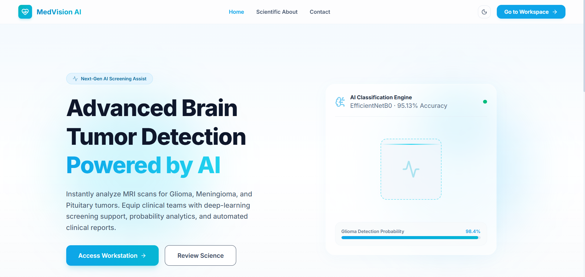
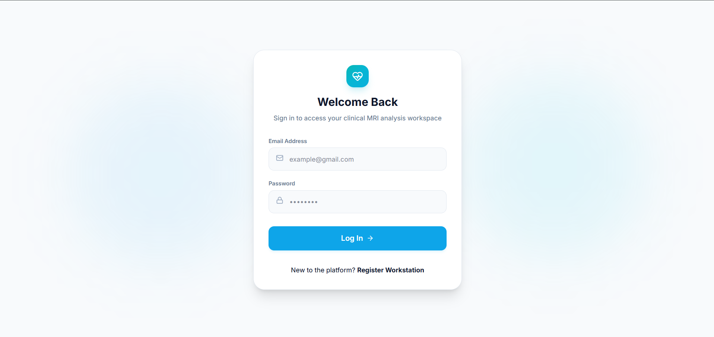
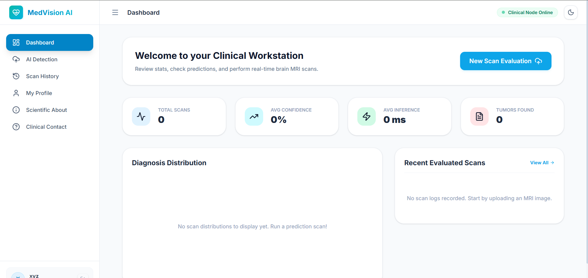
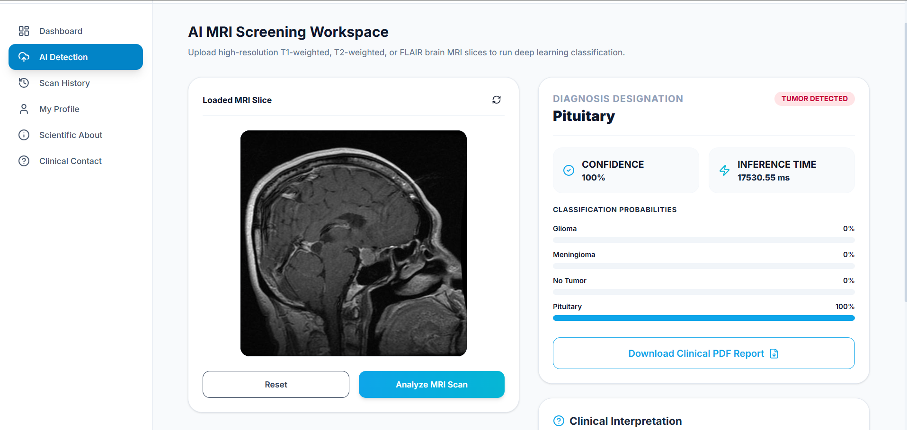

# 🧠 MedVision AI – Brain MRI Tumor Detection & Clinical Assistant

An AI-powered healthcare web application for automatic Brain MRI tumor classification using **EfficientNetB0**, **TensorFlow**, **FastAPI**, and **React**.

---

## 📌 Project Overview

MedVision AI is a deep learning-based web application developed to assist in the classification of Brain MRI images. The system uses the EfficientNetB0 convolutional neural network with transfer learning to classify MRI scans into four categories:

- 🧠 Glioma
- 🧠 Meningioma
- 🧠 Pituitary Tumor
- ✅ No Tumor

The application provides real-time predictions along with confidence scores and class probabilities through a modern, user-friendly interface.

> **Note:** This project is intended for educational and research purposes only and should not be used as a substitute for professional medical diagnosis.

---

## 🚀 Features

- AI-powered Brain MRI tumor classification
- EfficientNetB0 Transfer Learning model
- Four-class prediction
- Real-time MRI image upload
- Confidence score and class probabilities
- Secure user authentication
- Modern responsive healthcare dashboard
- Downloadable prediction reports
- Professional UI/UX

---

## 🛠️ Technologies Used

### Frontend
- React.js
- Vite
- Tailwind CSS
- React Router
- Axios

### Backend
- FastAPI
- Python
- SQLAlchemy
- JWT Authentication

### AI & Machine Learning
- TensorFlow
- Keras
- EfficientNetB0
- OpenCV
- NumPy
- Pillow

---

## 🧠 Deep Learning Model

| Parameter | Value |
|-----------|--------|
| Model | EfficientNetB0 |
| Transfer Learning | ImageNet |
| Image Size | 224 × 224 |
| Classes | 4 |
| Framework | TensorFlow / Keras |
| Validation Accuracy | **95.13%** |

### Classification Classes

- Glioma
- Meningioma
- Pituitary Tumor
- No Tumor

---

## 📂 Project Structure

```
Brain-MRI-Tumor-Detection-
│
├── frontend/
├── backend/
├── model/
│   └── Brain_MRI_EfficientNetB0.keras
├── screenshots/
├── requirements.txt
├── README.md
└── .gitignore
```

---

## 📸 Application Screenshots

### Home Page



### login Page



### Dashboard



### Prediction




## ⚙️ Installation

### Clone Repository

```bash
git clone https://github.com/Harshitha-n-b/Brain-MRI-Tumor-Detection-.git
```

### Navigate

```bash
cd Brain-MRI-Tumor-Detection-
```

### Install Backend Dependencies

```bash
pip install -r requirements.txt
```

### Start Backend

```bash
uvicorn main:app --reload
```

### Start Frontend

```bash
npm install
npm run dev
```

---

## 📈 Results

- Validation Accuracy: **95.13%**
- EfficientNetB0 Transfer Learning
- Four-class Brain MRI classification
- Fast and accurate predictions
- Responsive web interface

---

## 🎯 Future Scope

- Explainable AI using Grad-CAM
- Multi-disease MRI classification
- Cloud deployment
- Electronic Health Record integration
- Mobile application support
- Doctor dashboard and patient history management

---

## 👩‍💻 Author

**Harshitha N B**

B.Tech – Computer Science & Engineering

Presidency University, Bengaluru

GitHub: https://github.com/Harshitha-n-b

---

## 📜 License

This project is developed for educational and research purposes.
